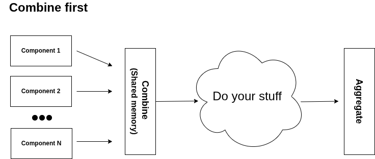
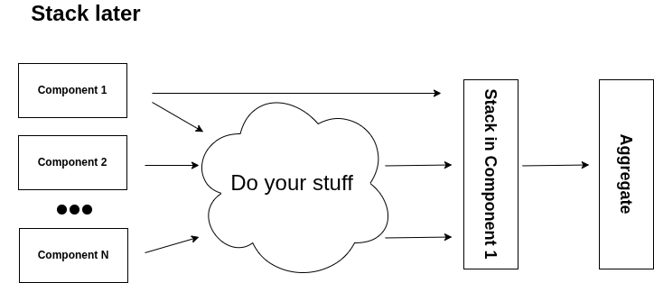

# Federation

This section explains how to use the federation setup. For a component to support federation, it must implement the following methods:

```python
def to_binary(self) -> bytes | None:
    """(Federation only) Serialize to bytes for federation operations."""

def from_binary(self, binary: bytes) -> object:
    """(Federation only) Deserialize from bytes for federation operations."""

def aggregate_strategy(self, components: set["FedOperations"]) -> None:
    """(Federation only) Define how to aggregate a set of federated components."""
```

There are two main ways to use federation:

- **Combine first**: This can only be used when all components run locally. The main idea is to simplify the process by allowing components to share memory.
- **Stack later**: A more standard federated approach where the "weights" or state of each component are combined at the end.

## Example class

For all the examples below, we will use this code:

```python
--8<-- "docs/examples/others/federation.py:example_1"
```

## Combine first

The diagram below shows the workflow:



Example 1:

```python
--8<-- "docs/examples/others/federation.py:example_2"
```

Example 2:

```python
--8<-- "docs/examples/others/federation.py:example_3"
```

## Stack

The diagram below shows the workflow:



Example 1:

```python
--8<-- "docs/examples/others/federation.py:example_4"
```

Example 2:

```python
--8<-- "docs/examples/others/federation.py:example_5"
```
