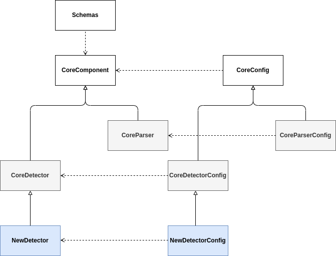

# Overall architecture

The overall architecture is divided in multiple components that can be run in the same script or separated into a micro-service architecture. All the components are design to use stream log data and have as input and output an [Schema](schemas.md).

## Components flow

The data flow only into a specific direction, logs are process by the parsers that generated parsed logs. After that the detectors use the parsed logs to generate alerts.


## Components architecture

Every component inherent from a CoreComponent class. This class contains all the functionality need it for the DetectMate to function (UMl bellow). Every [Detector](detectors.md) must inherent from the CoreDetector and evey [Parser](parsers.md) must inherent from the CoreParser for them to be compatible with DetectMate.

All the arguments of each component must be store in their respective config class. The config classes share same pattern design from the components and must inherent from the CoreConfig.




## Components methods

Bellow show a dummy code of the class structure of a component.

```python
class ConfigComponent(CoreConfig):
    """Contains all the arguments of the component"""


class Component(CoreComponent):
    def run(
        self, input_: List[BaseSchema] | BaseSchema, output_: BaseSchema
    ) -> bool:
    """Run the component for a specific input"""

    def train(
        self, input_: List[BaseSchema] | BaseSchema,
    ) -> None:
    """Train the component with a specific input"""

    def process(self, data: BaseSchema | bytes) -> BaseSchema | bytes | None:
    """Process the data in a stream fashion (Defined in the CoreComponent)"""

    def get_config(self) -> Dict[str, Any]:
    """"Get the configuration of the component (Defined in the CoreComponent)"""

    def update_config(self, new_config: Dict[str, Any]) -> None:
    """"Update the configuration of the component (Defined in the CoreComponent)"""
```

Go back [Index](index.md)
