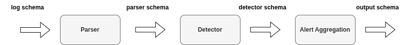
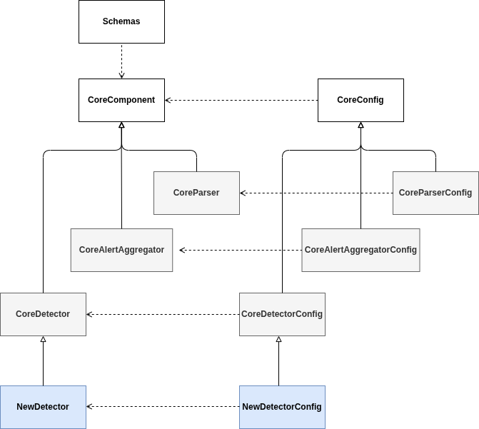

# Overall architecture

This document describes the high-level design of the DetectMateLibrary, how components interact, the data contracts they use, and guidance for deploying and extending the system. The library is built around small, composable components that operate on streaming log data and exchange strongly-typed Schema objects.

Key goals

- Clear separation of concerns (reading, parsing, detection, output).
- Stream-friendly processing with minimal buffering.
- Well-defined schema contracts so components can be composed or run as microservices.
- Easy extensibility: add new readers, parsers or detectors by subclassing core base classes.

## Components flow

The pipeline is strictly directional:

- **Parser**: consumes raw logs and produces parsed log objects (structured fields, timestamps, variables).
- **Detector**: consumes parsed logs and generates alerts/findings when rules or models match anomalous behavior.
- **Alert Aggregation**: consumes alerts and aggregates them.

Each arrow represents a stream of [Schema objects](schemas.md). Components are designed to run in the same process for lightweight setups or as separate services for scalable deployments.




## Components architecture

All components inherit from a `CoreComponent` class. This class provides all the essential functionality required for DetectMate to operate (see UML diagram below). Every [Detector](detectors.md) must inherit from `CoreDetector`, every [AlertAggregator](alert_aggregator.md) must inherit from `CoreAlertAggregation` and every [Parser](parsers.md) must inherit from `CoreParser` to ensure compatibility with DetectMate.

Each component’s arguments must be stored in its corresponding configuration class. These config classes follow the same design pattern as their components and must inherit from `CoreConfig`.




## Components methods

Each Core* base class exposes a small, stable API that implementations must implement or may override.

```python
class ConfigComponent(CoreConfig):
    """Contains all the arguments of the component"""


class Component(CoreComponent):
    def run(
        self, input_: List[BaseSchema] | BaseSchema, output_: BaseSchema
    ) -> bool:
    """Run the component for a specific input"""

    def train(
        self, input_: List[BaseSchema] | BaseSchema,
    ) -> None:
    """Train the component with a specific input"""

    def update_state(self, state: StatesL) -> None:
    """
    Update the current state by request of the user
    states:
    *   keep_training: force to keep training
    *   stop_training: force to stop training
    *   keep_configuring: force to keep configuring
    *   stop_configuring: force to stop configuring
    """

    def get_state(self) -> str:
    """
    Return the current state of the component
    states:
    *   Configuring: the component is doing configurations
    *   Training: the component is training
    *   Default: the component is just processing data
    """

    def export_state(
        self, path: str | None = None, storage_options: dict[str, Any] | None = None,
    ) -> bytes | None:
    """Export the current state if persistency class was implemented"""

    def import_state(
        self, path: str | bytes, storage_options: dict[str, Any] | None = None
    ) -> None:
    """Import the current state if persistency class was implemented"""

    def process(self, data: BaseSchema | bytes) -> BaseSchema | bytes | None:
    """Process the data in a stream fashion (Defined in the CoreComponent)"""

    def get_config(self) -> Dict[str, Any]:
    """Get the configuration of the component (Defined in the CoreComponent)"""

    def update_config(self, new_config: Dict[str, Any]) -> None:
    """Update the configuration of the component (Defined in the CoreComponent)"""

    def get_window_size(self) -> int:
    """Get window size of the data buffer"""

    def stack(self, other: object | list[object | bytes] | bytes) -> None:
    """(Federation only) stack multiple components for federation tasks"""

    def aggregate(self, unstack: bool = False) -> None | bytes:
    """(Federation only) aggregate multiple components"""

    def to_binary(self) -> bytes | None:
    """(Federation only) fill it to be compatible with federation ops"""

    def from_binary(self, binary: bytes) -> object:
    """(Federation only) fill it to be compatible with federation ops"""

    def aggregate_strategy(self, components: set["FedOperations"]) -> None:
    """(Federation only) fill it to be compatible with federation ops"""
```

Go back [Index](index.md)
