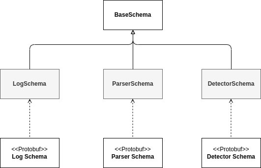

# Components: Schemas

The schemas are the "packages" that are used to transmit the data between the different components.

## Architecture

Schemas are use to transmit the data between components. Every schema follows the methods from **BaseSchema**. This class is a wrapper of the Protobuf classes (op.SchemaT).



The different methods that the schemas have are describe bellow:

```python
class BaseSchema:
    def __contains__(self, idx: str) -> bool:
        """Return if a variable is in the schema"""

    def as_dict(self) -> dict[str, Any]:
        """Return the schema variables as a dictionary."""

    def get_schema(self) -> op.SchemaT:
        """Retrieve the current schema instance."""

    def set_schema(self, schema: op.SchemaT) -> None:
        """Set the schema instance and update attributes."""

    def init_schema(self, kwargs: dict[str, Any] | None) -> None:
        """Initialize the schema instance and set attributes."""
        self.var_names = set(var_names)

    def is_field_list(self, field_name: str) -> bool:
        """Check if a field is a list."""

    def copy(self) -> "BaseSchema":
        """Create a deep copy of the schema instance."""

    def serialize(self) -> bytes:
        """Serialize the schema instance to bytes."""

    def deserialize(self, message: bytes) -> None | op.IncorrectSchema:
        """Deserialize bytes to populate the schema instance."""

    def check_is_same(self, other: Self) -> None | op.IncorrectSchema:
        """Check if another schema instance is of the same schema type."""

    def __eq__(self, other: object) -> bool:
        """Check equality between two schema instances."""
```

## Schema Clases

The different schema classes and their different variable types are listed bellow:

### LogSchema

LogSchema is the class that contain the raw logs.

```proto
// Protobuf class
message LogSchema {
    optional string __version__ = 1;
    optional string logID = 2;
    optional string log = 3;
    optional string logSource = 4;
    optional string hostname = 5;
}
```

### ParserSchema

LogSchema is the class that contain the raw logs.

```proto
// Protobuf class
message ParserSchema {
    optional string __version__ = 1;
    optional string parserType = 2;
    optional string parserID = 3;
    optional int32 EventID = 4;
    optional string template = 5;
    repeated string variables = 6;
    optional string parsedLogID = 7;
    optional string logID = 8;
    optional string log = 9;
    map<string, string> logFormatVariables = 10;
    optional int32 receivedTimestamp = 11;
    optional int32 parsedTimestamp = 12;
}
```

### DetectorSchema

LogSchema is the class that contain the raw logs.

```proto
// Protobuf class
message DetectorSchema {
    optional string __version__ = 1;
    optional string detectorID = 2;
    optional string detectorType = 3;
    optional string alertID = 4;
    optional int32 detectionTimestamp = 5;
    repeated string logIDs = 6;
    optional float score = 8;
    repeated int32 extractedTimestamps = 9;
    optional string description = 10;
    optional int32 receivedTimestamp = 11;
    map<string, string> alertsObtain = 12;
}
```

## Tutorial

Small tutorials of the different schemas.

### Initialize a schema

You can initialize a schema by using a dictionary with the same structure as the protobuf.

```python
kwargs = load_somewhere()  # load the dict
kwargs["log"] = "Test log"

log_schema = LogSchema(kwargs)
print(log_schema.log == "Test log")  # True
```


### Assign values

Schema classes have a friendly way to assign variables.

```python
log_schema = LogSchema()
log_schema.log = "Test log"
print(log_schema["log"] == log_schema.log)  # True

log_schema2 = LogSchema()
print(log_schema == log_schema2)  # False

log_schema2.log = "Test log"
print(log_schema == log_schema2)  # True
```

### Serialization

The schemas have internal methods to serialize and deserialize the classes. Note that for this it will use the internal protobuf class, so if a variable contain a wrong value it will break.

```python
log_schema = LogSchema()
log_schema.log = "Test log"
serialized = log_schema.serialize()
print(isinstance(serialized, bytes))  # True

new_log_schema = LogSchema()
new_log_schema.deserialize(serialized)
print(new_log_schema.schema_id == log_schema.schema_id)  # True
```

**Note**: The binary created is a concatenation of an ID byte and the bytes generated by the protobuf. If you not remove the first buff it will not work by default with protobuf.

Go back [Index](index.md)
